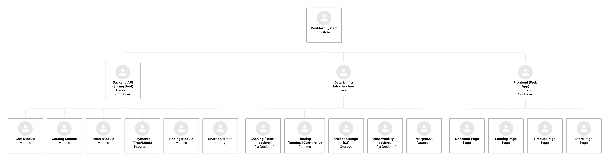

# devmart-backend

📐 DevMart Architecture

DevMart is structured as a lightweight e-commerce platform designed to showcase backend engineering, system design, and API development skills. I modeled the architecture before coding to clarify responsibilities, improve modularity, and make it easier to extend later.

Frontend (Web App): Landing, store, product, and checkout pages built to demonstrate UI → API flows.

Backend (Spring Boot API): Modular services for catalog, pricing, cart, and orders. Payments are mocked to focus on API design instead of integrations.

Data & Infrastructure: PostgreSQL for persistence, AWS S3 for image storage, optional Redis for caching, and logging/observability hooks for future scalability.

This architecture highlights separation of concerns (frontend vs. backend vs. infra), while keeping things small enough to finish as a personal project. It’s designed to be clear to hiring managers and flexible enough to expand into real deployments.
